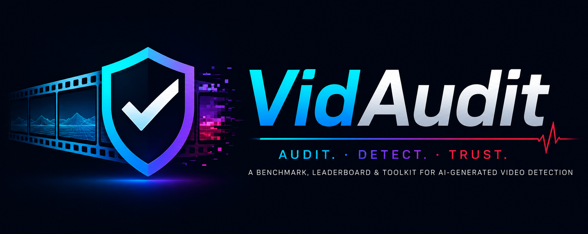
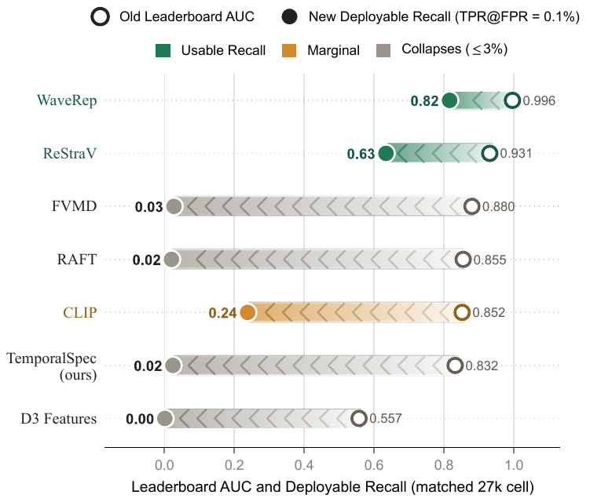

<p align="center">
  
</p>

<p align="center">
  <b>An audited benchmark, leaderboard, and toolkit for AI-generated video detection.</b><br>
  <sub>Evaluate any detector under one rigorous protocol. Train any method through a uniform script. Add your own behind a small plugin API.</sub>
</p>

<p align="center">
  <a href="https://github.com/KurbanIntelligenceLab/vidaudit/actions/workflows/tests.yml"></a>
  <a href="LICENSE"></a>
  
  
</p>

VidAudit is a standardized, **audited** evaluation suite for **AI-generated, synthetic, and deepfake video detection**. It exists because every AI-video-detection paper currently evaluates differently, our 20-paper survey shows none apply all six standard controls, and high leaderboard AUCs do not predict deployable recall. VidAudit makes the audited protocol the default and makes fair, reproducible comparison (and honest re-ranking by deployability) a single command.

---

## 🏆 Audited leaderboard

<p align="center">
  
</p>

<sub>Hollow = the leaderboard AUC papers report; filled = deployable recall (TPR at FPR 0.1%) on the matched 27k cell. High AUC, near-zero recall: most methods collapse at a usable operating point, exactly what the audit surfaces.</sub>

The primary cell is the **matched 27k-clip GenVidBench cell** under leave-one-generator-out (LOGO) evaluation. The headline number papers report is **LOGO-OOD AUC**; the audit adds the columns that decide whether it is real: the **real-vs-real floor** (`RvR`), the **above-floor margin**, and **deployable recall** (`TPR@0.1%`). Sorted by OOD AUC, so high-AUC methods visibly separate from genuinely robust ones.

| # | Model | LOGO-OOD AUC ↑ | RvR floor | Margin ↑ | TPR@0.1% ↑ | Verdict |
|--:|---|:--:|:--:|:--:|:--:|---|
| 1 | **WaveRep** | 0.996 | 0.534 | +0.462 | **0.816** | ✅ Certified, usable |
| 2 | **XSFF** (ours) | 0.946 | 0.604 | +0.342 | n/a | ✅ Certified |
| 3 | **ReStraV** | 0.931 | 0.586 | +0.345 | 0.634 | ✅ Certified, usable |
| 4 | **D3** | 0.887 | 0.421 | +0.466 | n/a | ✅ Certified (native head) |
| 5 | **FVMD** | 0.880 | 0.574 | +0.306 | 0.027 | ⚠️ Certified, collapses @0.1% |
| 6 | **TemporalSpec+aug** (ours) | 0.871 | 0.634 | +0.237 | 0.144 | ✅ Certified, marginal recall |
| 7 | **RAFT** | 0.855 | 0.627 | +0.228 | 0.020 | ⚠️ Certified, collapses @0.1% |
| 8 | **CLIP** | 0.852 | 0.766 | +0.086 | 0.238 | ❌ Caught (dataset identity) |
| 9 | **TemporalSpec** (ours) | 0.832 | 0.643 | +0.189 | 0.024 | ⚠️ Certified, collapses @0.1% |
| 10 | **NSG-VD** | 0.660 | 0.596 | +0.064 | 0.015 | ❌ Near-floor (rides identity) |

**How to read the verdict.**
- ✅ **Certified**: clears its real-vs-real floor by a wide margin, genuine cross-generator signal.
- ✅ **Certified, usable**: also keeps useful recall at a deployable false-positive rate.
- ⚠️ **Certified, collapses @0.1%**: strong AUC, but recall at FPR = 0.1% falls to near zero. The ranking and the deployability disagree.
- ❌ **Caught (dataset identity)**: a high real-vs-real AUC means the score largely reflects *which dataset the reals came from*, not generation artifacts.
- ❌ **Near-floor**: barely exceeds the dataset-identity floor at all.

**Column definitions.**
- **LOGO-OOD AUC**: leave-one-generator-out AUC on held-out generators.
- **RvR floor**: real-vs-real AUC (separating two *real* datasets). An artifact-based detector should sit near 0.5; a high value means dataset-identity leakage.
- **Margin**: LOGO-OOD minus RvR, the real generalization remaining above the floor.
- **TPR@0.1%**: true-positive rate at a 0.1% false-positive operating point (deployable recall).

**Other cells** (also in `leaderboard.csv` / `LEADERBOARD.md`).
- **AIGVDBench** (`aigvd-2284`): D3 scores **0.771** LOGO-OOD (native head). Only one real source, so the RvR floor does not apply; the current run used XCLIP-B/32 and a B/16 re-run is pending. Broader AIGVDBench coverage lands as those features ship.
- **GenVidBench full-116k** (unmatched): TemporalSpec **0.819**, for reference against the matched cell.

<sub>GenVidBench matched-27k cell; native head or uniform L2-LR readout per method. NSG-VD and TemporalSpec+aug operating points were computed with VidAudit's own audit engine (their AUC reproduces the paper value exactly). The two remaining `n/a` cells are not yet computed: **XSFF** needs its 34-d MV+ReStraV joint features reassembled, and **D3**'s native head needs re-running XCLIP inference (a GPU job). In the **Other cells** section, AIGVDBench's RvR is blank because that benchmark has a single real source, so the real-vs-real floor does not apply. The full 116k cell, bootstrap CIs, and the combined cross-dataset cell land here as the data package ships.</sub>

---

## What's inside
- **Six-control audit protocol (P1-P6)**: canonical re-encode, clip-length leakage filter, real-vs-real dataset-identity floor, matched-harness re-training, multi-seed/bootstrap CIs, and a true cross-dataset cell.
- **Audited leaderboard**: every detector labeled by the two verdicts above, with the full metric tuple (AUC, above-floor margin, TPR@FPR, calibration), not just AUC.
- **Model zoo**: 14 detectors behind one plugin API: **TemporalSpec** (ours), **D3**, **ReStraV**, **CLIP**, **RAFT**, **FVMD**, **WaveRep**, **NSG-VD**, **AIGVDet**, **STALL**, **L3DE**, **Skyra**, **VideoVeritas**, **Ivy-xDetector** (the last three MLLMs); backbones auto-download or load published checkpoints (sha256-verified via the zoo). Full table + setup below.
- **Standardized data package**: per-clip features, LOGO splits, provenance, and Croissant metadata, combining GenVidBench and AIGVDBench (bring-your-own-videos; we do not redistribute source clips).
- **Unified CLI**: `run.py extract` (clips → features) → `run.py eval` (audit → verdicts) → `run.py leaderboard`, plus a uniform, overridable trainer driven by shell scripts.

## Setup

**Prerequisites:** [Conda](https://docs.conda.io/) (Miniforge or Miniconda) and `git`. A GPU is optional: Apple Silicon (MPS) and CPU both work for development; heavy extraction and training are meant for a CUDA cluster, where the same `environment.yml` resolves a GPU build of torch.

```bash
# 1. Clone the repository
git clone <repo-url> vidaudit && cd vidaudit

# 2. Create the one unified environment (Python 3.14: audit + video/codec tooling +
#    deep backbones + training, in a single env)
conda env create -f environment.yml
#    For a byte-exact environment instead of pinned ranges:
#    conda env create -f environment.lock.yml

# 3. Activate it
conda activate vidaudit

# 4. Register the package (editable install; runtime deps come from conda, not pip)
pip install -e .

# 5. Verify
python -m pytest -q       # the test suite should pass
python run.py --help      # the CLI entry point
```

That single environment covers everything. On a CUDA cluster, build the env on a login node with `scripts/cluster_build_env.sh`.

## ✅ Per-model verification

Every wrapped detector's evaluation path (and the trainer) is exercised by the test suite on synthetic inputs, with no heavy weights or GPU, so a fresh clone can confirm the whole zoo works in one command (`python -m pytest -q`). The table below is generated from the actual run by `scripts/gen_verification_matrix.py` (CI re-checks it on every push):

<!-- VERIFY-MATRIX:START -->
_Auto-generated by `scripts/gen_verification_matrix.py` from the test suite: 156 tests, all green. Each row exercises that model's eval/train path on synthetic inputs with no heavy weights or GPU._

| Model | Family | Tests | Status |
|---|---|--:|:--|
| WaveRep | forensic | 13 |  |
| D3 | appearance | 12 |  |
| ReStraV | appearance | 9 |  |
| CLIP | appearance | 7 |  |
| RAFT | motion | 13 |  |
| FVMD | motion | 9 |  |
| NSG-VD | forensic | 12 |  |
| TemporalSpec | codec | 13 |  |
| AIGVDet | fusion | 10 |  |
| STALL | fusion | 7 |  |
| L3DE | fusion | 3 |  |
| Skyra / VideoVeritas / Ivy | mllm | 5 |  |
| MLP-Probe + trainer | training | 7 |  |
| Toolkit core (audit, harness, data, CLI) | framework | 36 |  |
<!-- VERIFY-MATRIX:END -->

## Tutorial

The workflow is **extract → audit → (train) → leaderboard**, one command per step. The input is a `clips.csv` manifest with columns `(video_id, generator, label, is_real, mp4_path)`: one row per clip, `is_real=1` for real sources and `0` for generated, and `generator` naming the model (or the real source).

**Step 1: Extract a detector's per-clip features.** The auto-download detectors (D3, ReStraV, CLIP, RAFT) and TemporalSpec (codec motion vectors) need no setup; WaveRep / FVMD / NSG-VD take a checkpoint via `--weights`.
```bash
python run.py extract restrav --manifest clips.csv --out restrav.csv
python run.py extract waverep --manifest clips.csv --out waverep.csv \
       --weights /path/to/weights_dinov2_G4.ckpt
```

**Step 2: Audit the feature table.** Runs the six-control protocol and prints one leaderboard record. `--subset` restricts to a matched cell.
```bash
python run.py eval --features restrav.csv --subset baseline_clip_subset.csv
```
The record reports `logo_ood` (cross-generator AUC), `rvr` (the real-vs-real floor), `margin` (above-floor headroom), and `tpr01` / `pauc10` / `brier` / `ece`, plus a **floor verdict** (certified / caught / marginal / leakage) and a **deploy tier** (usable / marginal / collapses).

**Step 3: Audit a native head's own scores** (no readout retraining), e.g. D3's published decision:
```bash
python run.py extract d3 --manifest clips.csv --out d3_scores.csv --kind score
python run.py eval --scores d3_scores.csv
```
To train instead of using a published head, the standard trainer fits a head over any feature table: `scripts/train/restrav.sh clips.csv` or `python run.py train mlp-probe --features restrav.csv` (see [Training](#training)).

**Step 4: Render the leaderboard** from `leaderboard.csv`:
```bash
python run.py leaderboard      # writes LEADERBOARD.md
```

To regenerate the whole leaderboard in one pass (extract → eval → render for every wrapped detector), run `scripts/run_all.sh <prepared_manifest.csv>` (the manifest from `prepare-data`; checkpoints for the weighted detectors via `WAVEREP_CKPT`/`NSGVD_CKPT`/`ADM_CKPT`).

Heavy extraction or training belongs on a cluster; wrap any step in an sbatch (the env is built with `scripts/cluster_build_env.sh`). `fetch-weights <name>` downloads and sha256-verifies a checkpoint from the zoo; `prepare-data <dataset> --source <dir>` preprocesses a downloaded dataset (P1 re-encode + P2 length filter) into the audit format.

## Add your own detector (plugin API)
Subclass `Detector`, set a `DetectorSpec`, implement at least one evidence interface, and register it. The audit, metrics, and leaderboard row come for free:
```python
from vidaudit.detectors import Detector, DetectorSpec, register

@register("mymethod")
class MyMethod(Detector):
    spec = DetectorSpec(name="MyMethod", family="appearance", backbone="ViT-L/14",
                        published_weights=True, trainable=False, paper="arXiv:25xx")

    def score(self, clip):        # native head -> p(generated)
        return my_model(clip.path)

    # optional: features(clip) for the uniform L2-LR readout,
    #           load_weights() for download-and-evaluate,
    #           build_model()/default_train_config() to be trainable.
# python run.py eval mymethod   ->   P1-P6 audit + a leaderboard row
```
A detector has three orthogonal capabilities: **evaluate** (`score` and/or `features`), **load weights** (`load_weights`), and **train** (`build_model` + `default_train_config`, driven by the standard trainer). Training-free methods leave `trainable=False`. See `FRAMEWORK.md` for the full contract.

## Add a dataset
Datasets live behind a registry, so the audit pipeline never changes. A new benchmark is a thin adapter:
```python
from vidaudit.data.datasets import VideoDataset, DatasetSpec, register_dataset

@register_dataset("mybench")
class MyBench(VideoDataset):
    spec = DatasetSpec(name="mybench", generators=[...],
                       real_sources=["src_a", "src_b"],   # >=2 enables the RvR floor; <2 auto-disables it
                       fetch=<recipe>)                      # reconstruct clips locally (no redistribution)
    def clips(self, split, cell):
        ...   # yield Clip objects with provenance
# now available everywhere:  --dataset mybench   (and combinable:  --dataset genvidbench+mybench)
```

## Model zoo and weights
All fourteen baselines are wrapped behind the plugin API and run from clips via `run.py extract`. Five are clone-and-run (auto-download backbones or codec features); five take published checkpoints, fetched via the zoo (`fetch_weights` -> download + sha256-verify + cache) or passed with `--weights` (FVMD's tracker auto-fetches; WaveRep, NSG-VD, AIGVDet, and L3DE need a checkpoint); STALL is training-free but needs the gated DINOv3 backbone plus its released calibration file; and Skyra, VideoVeritas, and Ivy-xDetector are 3-9B MLLMs that auto-download from HuggingFace and ModelScope.

| Detector | Family | Backbone | Setup |
|---|---|---|---|
| TemporalSpec (ours) | codec | codec motion vectors (13-d) | none (PyAV codec MVs) |
| D3 | appearance | XCLIP-ViT-B/16 | auto-download (training-free) |
| ReStraV | appearance | DINOv2 ViT-S/14 | auto-download (torch.hub) |
| CLIP | appearance | CLIP-ViT-B/32 | auto-download |
| RAFT | motion | RAFT-Large optical flow | auto-download (torchvision) |
| FVMD | motion | PIPs++ point tracker | auto-fetch (public release) |
| WaveRep | forensic | DINOv2 ViT-B/14 + wavelet aug | checkpoint (zoo / `--weights`) |
| NSG-VD | forensic | ADM 256 diffusion + Swin discriminator | checkpoint + ~2GB ADM model |
| AIGVDet | fusion | two-stream ResNet50 (RGB + RAFT flow) | checkpoint (`--weights`; academic-only) |
| STALL | fusion | DINOv3 ViT-L/16 (frozen, training-free) | gated DINOv3 + released calibration npz (`--weights`) |
| L3DE | fusion | DINOv2-G + RAFT + UniDepth-v2 -> 3D-CNN | checkpoint (`--weights`); non-commercial (CC-BY-NC) |
| Skyra | mllm | Qwen2.5-VL-7B (SFT+RL) | HuggingFace auto-download (~16GB, GPU; soft verdict-token score) |
| VideoVeritas | mllm | Qwen3-VL-8B | ModelScope auto-download (~18GB, GPU; `pip install modelscope`) |
| Ivy-xDetector | mllm | Qwen2.5-VL-3B (IVY-FAKE) | HuggingFace auto-download (~7.5GB, GPU; `<conclusion>` verdict) |

Vendored model code (PIPs++ for FVMD, the NSG-VD codebase) lives under `vidaudit/_vendor/`, kept separate from our thin wrappers and carrying its upstream license.

AIGVDet was added from the literature-review sweep; its `original.pth` / `optical.pth` are on the authors' Google Drive (academic-only, not mirrored), so it joins the leaderboard once those weights are run on the cluster. Its spatial branch is exact; the optical branch uses torchvision RAFT + a standard flow visualization (the paper's `raft-things` can be swapped in for an exact match).

Skyra is the first MLLM-family detector, wrapped via a reusable Qwen-VL adapter (`vidaudit/detectors/mllm.py`) whose `score()` returns a soft p(generated) from the verdict-token logits (not a hard label) and `features()` pools the VLM hidden state. Being a 7B model it auto-downloads from HuggingFace and joins the leaderboard after a cluster run. **VideoVeritas** (Qwen3-VL-8B) is a second instance of the adapter with its weights on ModelScope (`pip install modelscope`), and **Ivy-xDetector** (Qwen2.5-VL-3B, IVY-FAKE) is a third, fetched from HuggingFace and emitting a `<conclusion>real/fake</conclusion>` verdict. Only **BusterX++** (gated + no published inference code) remains deferred.

**STALL** (training-free) and **L3DE** (heavy 3-cue fusion) were also added from the sweep. STALL embeds frames with a frozen DINOv3 ViT-L/16 and scores a clip by a whitened spatial/temporal Gaussian likelihood against a real-video calibration; its upstream repo carries no license, so the scoring math is reimplemented from the paper and the released VATEX calibration file plus the gated DINOv3 backbone are point-to-source. L3DE fuses DINOv2-ViT-G appearance, RAFT flow, and UniDepth-v2 depth in a small 3D-CNN; the UniDepth-v2 dependency makes it **non-commercial (CC-BY-NC-4.0)**, and its sigmoid is p(real), so `score()` returns `1 - sigmoid`. Both are GPU-heavy and join the leaderboard after a cluster run.

### Downloading the weights

FVMD's tracker and the three MLLMs auto-download on first use (the MLLMs need `pip install qwen-vl-utils accelerate`, plus `modelscope` for VideoVeritas): the hub IDs are `JoeLeelyf/Skyra-RL` (HuggingFace), `EricTanh/VideoVeritas` (ModelScope), and `AI-Safeguard/Ivy-Fake` (HuggingFace). The checkpoint detectors below need a one-time manual fetch from their original release; pass the file(s) with `--weights` (or `load_weights(path)`). `zoo/manifest.yaml` records a sha256 where available, so the checkpoint verifies on load.

**WaveRep** (`weights_dinov2_G4.ckpt`, 331 MB; the DINOv2 backbone auto-downloads):
```
wget -nc -P weights "https://www.grip.unina.it/download/prog/WaveRep_SynthVideoDet/weights_dinov2_G4.ckpt"
```

**NSG-VD** (a per-generator Swin discriminator from the repo + the ADM diffusion model, ~2.1 GB, from OpenAI guided-diffusion):
```
git clone https://github.com/ZSHsh98/NSG-VD.git           # ckpts/standard-Pika-mp.pth, standard-SEINE-mp.pth, ...
wget -O 256x256_diffusion_uncond.pt \
  https://openaipublic.blob.core.windows.net/diffusion/jul-2021/256x256_diffusion_uncond.pt
# run: --weights NSG-VD/ckpts/standard-Pika-mp.pth --adm-ckpt 256x256_diffusion_uncond.pt
```

**AIGVDet** (two ResNet50 branches on the authors' Google Drive; `pip install gdown`):
```
gdown 10EXwX9cXR0VuBmWq7QpMfotnPtIRKIsV -O checkpoints/original.pth   # spatial branch
gdown 1MiMkASZ-SDisCuLi-A7R-Yvqjzsy_BMC -O checkpoints/optical.pth    # optical branch
# run: --weights checkpoints   (the directory holding original.pth [+ optical.pth])
```

**L3DE** (`L3DE.pth` on Google Drive; DINOv2-ViT-G via torch.hub and UniDepth-v2 from HuggingFace auto-download). Non-commercial: UniDepth-v2 is CC-BY-NC-4.0.
```
gdown --fuzzy "https://drive.google.com/file/d/1wBAAsJPcsT_bIKXetDbd23PKjmCUtb5s/view" -O weights/L3DE.pth
```

**STALL** (training-free): the VATEX calibration file is committed in the repo; the DINOv3 ViT-L/16 backbone is gated (Meta).
```
wget -O stall_params_vatex_dino_v3.npz \
  https://raw.githubusercontent.com/OmerBenHayun/STALL/main/precomputed/stall_params_vatex_dino_v3.npz
# DINOv3 ViT-L/16: accept terms at https://ai.meta.com/resources/models-and-libraries/dinov3-downloads/
#   (or request access at https://huggingface.co/facebook/dinov3-vitl16-pretrain-lvd1689m), place the .pth,
#   then pass STALL(dinov3_dir=<clone of facebookresearch/dinov3>, dinov3_weights=<.pth>).
```

Excluded for now (no public weights): **DeMamba** (authors withhold the checkpoints, GitHub issues #5/#16/#21), DeCoF / VidGuard-R1 (no release).

## Data package

Standardize any benchmark in two steps: **download** the original dataset, then **preprocess** it into the audited inputs so everyone evaluates byte-identical clips. Two controls, one command:

- **P1 canonical re-encode** (`vidaudit/data/canonical.py`): one fixed H.264 recipe normalizes codec/container fingerprints (recorded as a `recipe_id`; H.264 because the codec-MV detectors need H.264 motion vectors).
- **P2 clip-length filter** (`vidaudit/data/filters.py`): measures duration→label leakage and enforces a common frame budget so length cannot stand in for content.

**Supported datasets** (download from the original source, then preprocess):

| Dataset | Download (original) | Adapter |
|---|---|---|
| GenVidBench | [github.com/genvidbench/GenVidBench](https://github.com/genvidbench/GenVidBench) (HF release) | `vidaudit/data/datasets/genvidbench.py` |
| AIGVDBench | [github.com/LongMa-2025/AIGVDBench](https://github.com/LongMa-2025/AIGVDBench) (HF dataset) | `vidaudit/data/datasets/aigvdbench.py` |

```bash
# 1. Download the original dataset to a local dir (see links above).
# 2. Preprocess it into the audit format (P1 re-encode + P2 filter). The adapter knows
#    the native layout (GenVidBench Pair{1,2}/<src>/; AIGVDBench reads its HF zips directly):
python run.py prepare-data genvidbench --source ~/downloads/GenVidBench --out data/gvb --min-frames 16
python run.py prepare-data aigvdbench  --source ~/downloads/AIGVDBench  --out data/aigvd --min-frames 16
#    (add --per-source N / --limit N for quick dev runs)
# 3. Extract features + audit:
python run.py extract temporalspec --manifest data/gvb/manifest.csv --out features/ts.csv
python run.py eval --features features/ts.csv
```

`prepare-data` writes a ready-to-extract `manifest.csv` + a `provenance.json` (recipe id, per-source counts, the original download URL). **Add a dataset** = a small adapter mapping its native layout to `Clip`s (`scan(root)`); see `vidaudit/data/datasets/`. `vidaudit/data/croissant.py` emits ML Croissant metadata for any feature tables you choose to publish.

## Training
Training is a first-class, standardized subsystem, not an optional hook. The trainer learns a classifier head over a precomputed feature table (the `extract` output), so it reuses the extract pipeline and never re-decodes video in the loop; preprocessing (median-impute → z-score) matches the audit and is persisted in the checkpoint. Defaults live in `scripts/train/<model>.sh`; loss / optimizer / scheduler / head are name-addressable registries you extend with a one-line decorator, and every knob is overridable on the command line (repeatable `--set key=value`, later wins; unknown keys route to `cfg.extra`):
```bash
# extract once, then train a head over the table
python run.py extract temporalspec --manifest clips.csv --out features/train.csv
scripts/train/mlp-probe.sh features/train.csv          # documented defaults

# override loss / lr / schedule / head with no code edits
OUT=runs/probe scripts/train/mlp-probe.sh features/train.csv \
  --set loss=focal --set focal_gamma=1.5 --set lr=3e-4 --set head=linear --set epochs=100
```
`MLP-Probe` (the trainable counterpart to the audit's fixed L2-LR readout) ships as the reference that validates the trainer end-to-end; paper-specific trainable heads (ReStraV, NSG-VD) plug in via the same `build_model` + `default_train_config`. For the paper we run **eval only** (published weights and native heads through the audit); the trainer ships and is validated, but we do not retrain methods to manufacture results.

## Roadmap
- [x] Plugin API (eval / load-weights / train as three orthogonal capabilities)
- [x] Unified conda environment (pinned + lockfile)
- [x] Audit engine in `vidaudit/audit/` (matched-cell LOGO + RvR + the metric tuple + both verdicts), reproduces the paper numbers on real feature CSVs
- [x] `run.py` CLI: `extract`, `eval --features`, `eval --scores`, `train`, `leaderboard`, `prepare-data`, `fetch-weights`
- [x] Closed extract/train → eval loop: `audit_scores` audits a native or trained head's own scores (no readout) through the same LOGO + RvR + metric tuple + verdicts
- [x] Detector wrappers for all 11 baselines (auto-download / checkpoint / MLLM tiers), each smoke-tested from clips
- [x] Literature-review sweep added **AIGVDet**, **STALL**, **L3DE**, **Skyra**, **VideoVeritas**, and **Ivy-xDetector** (six new wrappers; STALL reimplements its unlicensed scoring math, L3DE is non-commercial via UniDepth-v2); only **BusterX++** (gated + no published inference code) remains deferred
- [x] Weight-fetch zoo (`fetch_weights` + `zoo/manifest.yaml`, sha256-verified)
- [x] Standardized data package: P1 canonical re-encode + P2 length filter + dataset adapters (GenVidBench, AIGVDBench) + `prepare-data` + Croissant emitter
- [ ] Dataset adapters for more benchmarks + a hosted leaderboard view `[planned]`
- [x] Standardized trainer (`TrainConfig` + registries + uniform loop), validated end-to-end on `MLP-Probe`
- [x] First per-detector recipe: ReStraV trainable head over the standard trainer (`scripts/train/restrav.sh`)
- [ ] WaveRep / NSG-VD trainable heads `[next]`
- [ ] AIGVDBench combined cross-dataset cell (D3 re-run at XCLIP-B/16) `[planned]`

See `FRAMEWORK.md` for the full design, the plugin contract, and the build phases.

## Citation
_To be added after publication._

## License
VidAudit's own code is **MIT** (see `LICENSE`). That covers only our first-party code: the audit engine, the plugin API, the data package, and the detector wrappers.

Wrapped detectors, their backbones, and the benchmark datasets keep their original licenses, and several are non-commercial, research-only, or carry no declared license (for example, WaveRep and AIGVDet are non-commercial; L3DE pulls in UniDepth-v2 under CC-BY-NC-4.0; Ivy-xDetector's Qwen base is under the non-commercial Qwen Research License; STALL's upstream code carries no license and its DINOv3 backbone is gated). VidAudit does not mirror or redistribute any third-party weights or data; you obtain each from its original source and are responsible for complying with its terms. The MIT grant does not extend to these components, so commercial use of a wrapped model or dataset may not be permitted even though VidAudit's own code is MIT. See each model-zoo and data-package entry for the specific license.

## References

Every wrapped detector, its key backbone/components, the benchmarks, and methods we could not include yet, with their original papers.

**Detectors (model zoo)**
- **TemporalSpec** (ours; codec motion vectors). VidAudit / WACV 2027. _Citation to be added after publication._
- **D3** (X-CLIP backbone; training-free). C. Zheng, R. Suo, C. Lin, Z. Zhao, L. Yang, S. Liu, M. Yang, C. Wang, C. Shen. "D³: Training-Free AI-Generated Video Detection Using Second-Order Features." ICCV 2025. [arXiv:2508.00701](https://arxiv.org/abs/2508.00701).
- **ReStraV** (DINOv2 backbone). C. Internò et al. "AI-Generated Video Detection via Perceptual Straightening." NeurIPS 2025. [arXiv:2507.00583](https://arxiv.org/abs/2507.00583).
- **WaveRep** (DINOv2 + forensic augmentation). R. Corvi, D. Cozzolino, E. Prashnani, S. De Mello, K. Nagano, L. Verdoliva. "Seeing What Matters: Generalizable AI-Generated Video Detection with Forensic-Oriented Augmentation." NeurIPS 2025. [arXiv:2506.16802](https://arxiv.org/abs/2506.16802).
- **NSG-VD** (ADM diffusion + Swin discriminator). S. Zhang, Z. Lian, J. Yang, D. Li, G. Pang, et al. "Physics-Driven Spatiotemporal Modeling for AI-Generated Video Detection." NeurIPS 2025. [arXiv:2510.08073](https://arxiv.org/abs/2510.08073).
- **FVMD** (PIPs++ point tracker). J. Liu, Y. Qu, Q. Yan, X. Zeng, L. Wang, R. Liao. "Fréchet Video Motion Distance: A Metric for Evaluating Motion Consistency in Videos." 2024. [arXiv:2407.16124](https://arxiv.org/abs/2407.16124).
- **CLIP** (appearance baseline). A. Radford et al. "Learning Transferable Visual Models From Natural Language Supervision." ICML 2021. [arXiv:2103.00020](https://arxiv.org/abs/2103.00020).
- **RAFT** (optical-flow baseline). Z. Teed, J. Deng. "RAFT: Recurrent All-Pairs Field Transforms for Optical Flow." ECCV 2020. [arXiv:2003.12039](https://arxiv.org/abs/2003.12039).
- **AIGVDet** (two-stream ResNet50: RGB + RAFT flow). J. Bai, M. Lin, G. Cao. "AI-Generated Video Detection via Spatio-Temporal Anomaly Learning." PRCV 2024. [arXiv:2403.16638](https://arxiv.org/abs/2403.16638).
- **STALL** (training-free; frozen DINOv3 + whitened spatial/temporal likelihood). O. Ben Hayun, R. Betser, M. Y. Levi, L. Kassel, G. Gilboa. "Training-free Detection of Generated Videos via Spatial-Temporal Likelihoods." CVPR 2026. [arXiv:2603.15026](https://arxiv.org/abs/2603.15026).
- **L3DE** (DINOv2-ViT-G + RAFT flow + UniDepth-v2 depth -> 3D-CNN; non-commercial via UniDepth-v2). Chang et al. ICCV 2025. [arXiv:2406.19568](https://arxiv.org/abs/2406.19568).
- **Skyra** (Qwen2.5-VL-7B reasoning MLLM). CVPR 2026. [arXiv:2512.15693](https://arxiv.org/abs/2512.15693).
- **VideoVeritas** (Qwen3-VL-8B reasoning MLLM). ICML 2026. [arXiv:2602.08828](https://arxiv.org/abs/2602.08828).
- **Ivy-xDetector** (Qwen2.5-VL-3B; the IVY-FAKE explainable image/video AIGC detector). Pi3AI / AI-Safeguard. 2025. [arXiv:2506.00979](https://arxiv.org/abs/2506.00979).

**Backbones & components**
- **X-CLIP** (D3). B. Ni et al. "Expanding Language-Image Pretrained Models for General Video Recognition." ECCV 2022. [arXiv:2208.02816](https://arxiv.org/abs/2208.02816).
- **DINOv2** (ReStraV, WaveRep). M. Oquab et al. "DINOv2: Learning Robust Visual Features without Supervision." TMLR 2024. [arXiv:2304.07193](https://arxiv.org/abs/2304.07193).
- **Swin Transformer** (NSG-VD discriminator). Z. Liu et al. "Swin Transformer: Hierarchical Vision Transformer using Shifted Windows." ICCV 2021. [arXiv:2103.14030](https://arxiv.org/abs/2103.14030).
- **ADM / guided diffusion** (NSG-VD score function). P. Dhariwal, A. Nichol. "Diffusion Models Beat GANs on Image Synthesis." NeurIPS 2021. [arXiv:2105.05233](https://arxiv.org/abs/2105.05233).
- **PIPs++ / PointOdyssey** (FVMD tracker). Y. Zheng, A. W. Harley, B. Shen, G. Wetzstein, L. J. Guibas. "PointOdyssey: A Large-Scale Synthetic Dataset for Long-Term Point Tracking." ICCV 2023. [arXiv:2307.15055](https://arxiv.org/abs/2307.15055).

**Benchmarks**
- **GenVidBench**. Z. Ni et al. "GenVidBench: A 6-Million Benchmark for AI-Generated Video Detection." AAAI 2026. [arXiv:2501.11340](https://arxiv.org/abs/2501.11340).
- **AIGVDBench**. L. Ma, Z. Xue, Y. Wang, Z. Yan, J. Xu, X. Jiang, H. Yu, Y. Liao, Z. Bi. "Your One-Stop Solution for AI-Generated Video Detection." 2026. [arXiv:2601.11035](https://arxiv.org/abs/2601.11035).

**Other detectors (no public weights, not yet in the zoo)**
- **DeMamba**. H. Chen et al. "DeMamba: AI-Generated Video Detection on Million-Scale GenVideo Benchmark." 2024. [arXiv:2405.19707](https://arxiv.org/abs/2405.19707).
- **DeCoF**. L. Ma, Z. Yan, Q. Guo, Y. Liao, H. Yu, P. Zhou. "Detecting AI-Generated Video via Frame Consistency." 2024. [arXiv:2402.02085](https://arxiv.org/abs/2402.02085).
- **VidGuard-R1**. K. Park et al. "VidGuard-R1: AI-Generated Video Detection and Explanation via Reasoning MLLMs and RL." 2025. [arXiv:2510.02282](https://arxiv.org/abs/2510.02282).
- **BusterX++** (reasoning MLLM detector). Assessed in the literature sweep but deferred: gated HuggingFace weights and no published inference code.

---
<sub>Keywords: AI-generated video detection, synthetic video detection, deepfake video detection, video forensics, generative video benchmark, detection leaderboard, evaluation toolkit, model zoo, GenVidBench, AIGVDBench, AIGC video, diffusion video detection.</sub>
